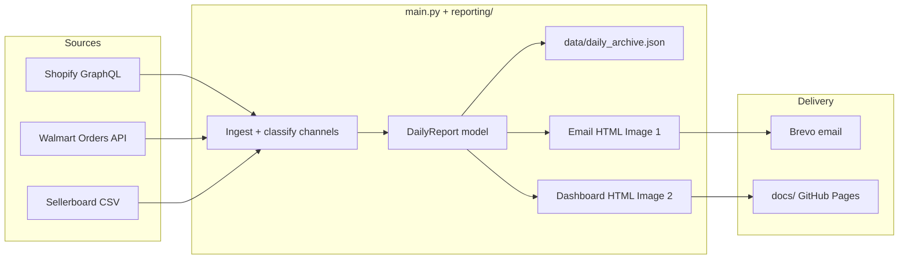

# Daily Revenue by Sales Platform

Automated previous-day revenue reporting across **Amazon (Sellerboard)**, **Shopify Direct**, **DICK'S SPORTING GOODS**, **Nordstrom**, and **Walmart**, with:

1. A plain-text-style **Brevo HTML email** (Image 1 layout)
2. A hosted **WEATHERMAN Daily Revenue Dashboard** under `docs/` (Image 2 layout)

The GitHub Actions workflow **`Daily Revenue Report Pipeline`** (file: `.github/workflows/daily_report.yml`) runs daily at **14:35 UTC (10:35 AM ET)** (`35 14 * * *`) and can also be triggered via `workflow_dispatch` (`target_date`, `backfill`, `force_backfill`, `send_email`).

```bash
# List / trigger (use the workflow display name, not the file name):
gh workflow list --repo WeathermanInc/Daily-revenue-by-sales-platform
gh run list --repo WeathermanInc/Daily-revenue-by-sales-platform --workflow "Daily Revenue Report Pipeline" --limit 5
gh workflow run "Daily Revenue Report Pipeline" --repo WeathermanInc/Daily-revenue-by-sales-platform \
  -f send_email=true -f target_date=YYYY-MM-DD -f backfill=false -f force_backfill=false
```

Hosted dashboard: https://weathermaninc.github.io/Daily-revenue-by-sales-platform/

---

## Project Architecture & Stats

| Integration | Mechanism | Auth | Refresh / window | Rate limits & notes |
|---|---|---|---|---|
| **Shopify** | Admin GraphQL `orders` (+ line items, tags, channel info) | Dev Dashboard `client_credentials` (`SHOPIFY_CLIENT_ID` / `SHOPIFY_CLIENT_SECRET`) → short-lived `X-Shopify-Access-Token` | Target day `America/New_York` **00:00:00–23:59:59 ET** (half-open `[day, day+1)`) | Split into Shopify Direct / DSG / Nordstrom via tags + channel name. Nordstrom uses the same **createdAt** ET calendar day as the Nordstrom Summary digest (no EDI day-lag). Metric: **Gross Revenue** (`totalPriceSet` / Shopify `total_price`). Optional Mirakl OR11 merge when `MIRAKL_API_KEY` is set. |
| **Walmart** | Marketplace Orders API after OAuth | Client credentials | Target day ET | Status × fulfillment matrix, then dedupe. Category + SKU rollups included. |
| **Sellerboard** | Permanent automation CSV `GET` | Token in URL | Daily + product exports | Daily CSV → Amazon revenue / units / Real ACOS. **Product (Dashboard by Product) CSV** → Amazon SKU drilldown + category matrix. Dates default to **DD/MM** (EU). |
| **Brevo** | `POST /v3/smtp/email` | API key | Each successful run | Subject: `Daily revenue by sales platform — YYYY-MM-DD`. CTA links to hosted dashboard. |

**Failure model:** each source is isolated. Failed channels render as `Unavailable (<reason>)` in the email/dashboard (missing secrets, OAuth errors, HTTP failures) without blocking Brevo for the rest. Startup logs a source-env preflight naming which integrations are missing credentials.

---

## Data Flow Architecture



---

## Report outputs

### Email (Image 1)
- Greeting (`Hi Rick,`) + long-form target date
- Revenue by sales platform (5 channels + Total)
- Category unit totals
- Ad metrics (Amazon Real ACOS, Shopify blended COS, revenue per ad dollar)
- Blue CTA `#1A73E8` → **dated** hosted dashboard URL (`…/{YYYY-MM-DD}.html`), labeled `Daily Revenue Dashboard MM-DD-YYYY`

### Dashboard (Image 2)
Written to:
- `docs/index.html` (latest)
- `docs/YYYY-MM-DD.html` (dated snapshot)
- `docs/email-YYYY-MM-DD.html` (email preview for QA)

Sections: navy **WEATHERMAN** header, period overview cards, platform performance, ad/reconciliation cards, **category units by platform** (including Amazon), **new product introductions by channel** (Skyline Stripe / Dusty Lavender / Rusty Orange Trek), and **SKU drilldown · five channels**.

There is **no** green status banner on the dashboard; operational notes stay in logs / email only.

Enable **GitHub Pages** from the `docs/` folder on `main`, then set optional secret `DASHBOARD_PUBLIC_URL` to the Pages **site root** (no trailing file name), e.g. `https://weathermaninc.github.io/Daily-revenue-by-sales-platform`. Each run writes `docs/{YYYY-MM-DD}.html` and copies it to `docs/index.html`; Brevo CTAs always link the dated file so older emails keep resolving.

---

## Sellerboard (Amazon) details

| Concern | Behavior |
|---|---|
| Daily totals | `SELLERBOARD_DAILY_URL` — exact calendar-day match only (never sums a multi-day export) |
| SKU + categories | `SELLERBOARD_PRODUCT_URL` — prefer **Dashboard by Product** (Date + SKU/ASIN + Units + Sales). Rows for `target_date` feed Amazon column in category matrix and Amazon lines in SKU drilldown |
| Date locale | Numeric dates default to **DD/MM/YYYY** (`11/09/2026` = 11 Sep). Day-first is auto-detected when any day component is `> 12`; override with `SELLERBOARD_DAYFIRST` |
| Day-scoped snapshot | If a CSV has **no** date column, it is treated as a same-day automation snapshot for `target_date` |
| Archive merge | If a live parse returns Amazon `$0` but a prior archive day had revenue, the prior channel total is preserved so MTD/forecast stay continuous |

---

## Roadblocks & Technical Considerations

| Risk | Mitigation |
|---|---|
| Sellerboard temporary URLs return HTML | Use permanent automation links only; HTML responses mark Amazon Unavailable |
| Sellerboard DD/MM vs MM/DD | Default DMY + day-first detection; set `SELLERBOARD_DAYFIRST=us` only for US-formatted exports |
| Amazon KPI without SKUs | Ensure product URL is itemized (Dashboard by Product / Orders), not daily aggregate-only |
| Shopify Admin API 401 / Unavailable channels | Prefer secret `SHOPIFY_ACCESS_TOKEN` (`shpat_…`) — used directly as `X-Shopify-Access-Token` (skips OAuth). Only when unset: Dev Dashboard `SHOPIFY_CLIENT_ID` + `SHOPIFY_CLIENT_SECRET` → `client_credentials`. Also set `SHOPIFY_STORE_URL`. |
| Sellerboard HTTP 401 | Rotate/verify `SELLERBOARD_DAILY_URL` + `SELLERBOARD_PRODUCT_URL` automation links. Pipeline logs a clear notice and falls back to archived Amazon totals for that date when available. |
| Amazon umbrella titles mentioning “Backpack” | Classify **umbrella** before use-case keywords; map `WM-40002-*` Venture Dry Pack to backpack |
| Shopify Direct inflation | Date-only query tokens + ET calendar-day post-filter; exclude draft/POS/void/cancelled |
| Nordstrom vs Summary mismatch | Nordstrom uses **Gross Revenue** + **createdAt** ET calendar day + optional Mirakl OR11 (same as Nordstrom Summary). Not Net Product Sales (`subtotal_price`). |
| Shopify ad spend not in Admin API | `SHOPIFY_AD_SPEND`, or dated JSON/CSV (`data/shopify_ad_spend.json`) |
| Partial API failures | Per-source try/except; email/dashboard still publish |
| MTD / forecast / last month | Rolling `data/daily_archive.json`; optional `--backfill` + validated Aug/Sep baseline seed |

---

## Environment Configuration

| Secret / env | Required | Purpose |
|---|---|---|
| `SHOPIFY_CLIENT_ID` / `SHOPIFY_CLIENT_SECRET` | Yes | Dev Dashboard app credentials → `client_credentials` Admin token |
| `SHOPIFY_STORE_URL` | Yes | `weatherman3.myshopify.com` (or shop slug). Aliases: `SHOPIFY_STORE_DOMAIN`, `SHOPIFY_SHOP_NAME` |
| `SHOPIFY_ACCESS_TOKEN` | Optional | Legacy static Admin token fallback only |
| `WALMART_CLIENT_ID` / `WALMART_CLIENT_SECRET` | Yes | Marketplace OAuth |
| `SELLERBOARD_DAILY_URL` / `SELLERBOARD_PRODUCT_URL` | Yes | Permanent CSV automation URLs (daily + product) |
| `SELLERBOARD_DAYFIRST` | Optional | `true`/`dmy` (default) or `us`/`0` for MM/DD exports |
| `BREVO_API_KEY` | Yes | Transactional email |
| `REPORT_RECIPIENTS` | Yes | Comma/semicolon emails. Defaults include marco/rick/christine/margo/sajjad/mollie + `slease@saxadvisorygroup.com` |
| `BREVO_SENDER_EMAIL` | Recommended | Verified Brevo sender |
| `BREVO_SENDER_NAME` | Optional | Default `Weatherman Revenue` |
| `DASHBOARD_PUBLIC_URL` | Recommended | GitHub Pages **site root** (no filename), e.g. `https://weathermaninc.github.io/Daily-revenue-by-sales-platform`. CTA always appends `/{YYYY-MM-DD}.html` |
| `SHOPIFY_AD_SPEND` | Optional | Day’s Shopify ad spend (USD) |
| `SHOPIFY_ADS_JSON_PATH` / `SHOPIFY_ADS_CSV_*` | Optional | Dated ad-spend feeds |
| `MIRAKL_API_KEY` / `MIRAKL_SHOP_ID` | Optional | Align Nordstrom with Summary (OR11 Mirakl-only orders) |
| `MIRAKL_BASE_URL` | Optional | Default `https://nordstromus-prod.mirakl.net` |
| `REPORT_GREETING_NAME` | Optional | Default `Rick` |
| `REPORT_DATE` | Optional | Same as `--date YYYY-MM-DD` |
| `SKIP_EMAIL` | Optional | `1`/`true` skips Brevo |

---

## Local Development & Testing

```bash
cd Daily-revenue-by-sales-platform
python -m venv .venv
source .venv/bin/activate
pip install -r requirements.txt
cp .env.example .env   # fill secrets
```

**UI-only demo** (no APIs / no Brevo) — renders Image 1/2 sample (classic Sep 10 mockup, or synthetic SKUs/categories for other dates):

```bash
python main.py --demo
python main.py --date 2026-09-11 --demo --skip-email
# open docs/index.html and docs/email-*.html
```

Without API secrets, `python main.py --date …` **auto-falls back to demo** so local verification still produces dashboard artifacts.

**Targeted / live run:**

```bash
python main.py --date 2026-09-11 --skip-email
python main.py --backfill --date 2026-09-10 --skip-email
python main.py --backfill --force --no-seed-baseline --skip-email
```

---

## Repository layout

```
├── main.py                         # Ingestion + orchestration
├── reporting/
│   ├── models.py                   # DailyReport data model
│   ├── categories.py               # SKU → category mapping
│   ├── email_report.py             # Image 1 Brevo HTML
│   └── dashboard.py                # Image 2 hosted dashboard HTML
├── docs/                           # Generated dashboard (GitHub Pages)
├── data/
│   ├── daily_archive.json          # MTD / last-month rollup archive
│   └── shopify_ad_spend.json       # Optional dated Shopify ad spend
├── scripts/
│   ├── fetch_walmart_sales.py
│   ├── backfill_archive.py
│   ├── monthly_deck_sources.py     # Live Shopify / Sellerboard / TW loaders
│   ├── update_monthly_deck.py      # Monthly Business Review PPTX + Slides plan
│   └── render_monthly_deck_charts.py  # Line-bar / table / OOS PNGs for Slides
├── output/monthly_decks/           # Generated dated MBR decks + charts/ (local)
└── .github/workflows/daily_report.yml
```

---

## Monthly Business Review deck

Creative deck (October 2026): [`1Z5rlR-udC7_YHhbIVwuIQChI5nEz_72RMd5ODkSr5bA`](https://docs.google.com/presentation/d/1Z5rlR-udC7_YHhbIVwuIQChI5nEz_72RMd5ODkSr5bA/).

`scripts/update_monthly_deck.py` (+ `scripts/monthly_deck_sources.py`) builds a dated PowerPoint **and** a Google Slides update plan that overwrites live metric cards/tables on the creative deck. Chart PNGs are rendered separately by `scripts/render_monthly_deck_charts.py` and inserted with Drive MCP / Slides API (`insertSlidesLocalImage`).

| Source | What it supplies |
|---|---|
| Shopify Admin API (MCP / client credentials) | Live D2C revenue, orders, AOV for the target month |
| Sellerboard daily CSV or `data/sellerboard_daily_cache.json` | Amazon revenue, Real ACOS → ROAS / TACOS |
| `data/daily_archive.json` | Retailer channels + YTD monthly series + MoM baselines (no 2025 days) |
| Sunny IP Tracker sheet | SKU velocity, stock / OOS |
| `data/monthly_ad_metrics.json` / `shopify_ad_spend.json` (optional) | CAC / MER / CVR when ad feeds are available |
| Triple Whale API (`TRIPLE_WHALE_API_KEY`) or `data/triple_whale_export.json` | PTP (14), Channel Mix (15), Site Health sessions/bounce, **YoY MTD vs Oct 1–10 2025** |
| `data/ptp_targets.json` (optional) | Planned PTP figures; else prior-month Triple Whale actuals |

### Metric conventions (Oct 2026 QA)

| Metric | Rule |
|---|---|
| **MER** | Ads ÷ revenue × 100 (not ROAS× or P&L) |
| **YoY (slides 4 / 6 / 9)** | Triple Whale Summary for **same MTD window** last year (e.g. Oct 1–10 2025 vs Oct 2026 MTD). `daily_archive` has no 2025 days — do not leave “archive pending” when TW is available |
| **Amazon CVR / repeat purchase** | Not in Sellerboard daily export → show `—` (blank is intentional) |
| **Top landing pages (slide 7)** | Per-page paid landing SQL is not stable on TW API; clear stale September sessions and note pending until UI export is wired |
| **Headers** | Arial bold ~20–22 pt on section titles; WXM All-Channels total **48 pt** |
| **Charts 12–13** | Line-bar combo (channel bars + all-channel line), not ASCII overlays |
| **Slide 22** | Blue navy table header (not maroon) |
| **Slide 24** | Color-coded OOS cards (`oos_pretty.png`) |
| **Slides 19–23** | Do not re-inject duplicate title text boxes over table graphics |

Slides **3–24** are populated. Slides **25**, **27**, and **32+** are never modified.

```bash
python -m venv .venv && source .venv/bin/activate
pip install -r requirements.txt
python scripts/update_monthly_deck.py --month 2026-10 \
  --presentation-id 1Z5rlR-udC7_YHhbIVwuIQChI5nEz_72RMd5ODkSr5bA
# → output/monthly_decks/Weatherman — October 2026 Monthly Business Review.pptx
# → output/monthly_decks/slides_plan_2026-10.json

# Chart PNGs for slides 12–13, 22, 24:
python scripts/render_monthly_deck_charts.py --month 2026-10
# → output/monthly_decks/charts/ytd_linebar_*.png, table_retailers_blue.png, oos_pretty.png
```

Apply the Slides plan with a service account (or Drive MCP for image inserts):

```bash
python scripts/update_monthly_deck.py --month 2026-10 \
  --presentation-id 1Z5rlR-udC7_YHhbIVwuIQChI5nEz_72RMd5ODkSr5bA \
  --apply-slides --google-credentials /path/to/sa.json
```
